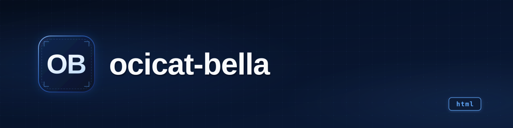

<p align="center">
  
</p>

<h1 align="center">Ocicat Bella</h1>

<p align="center"><b>Self-hosted platform for schools: centralized course materials, assignment
submissions, and isolated sandboxes where students run their code.</b></p>

<p align="center">
  
  
  
  
  
</p>

---

## What it is

Ocicat Bella is a FOSS, self-hosted web platform for schools. Teachers publish course materials
(files with inline preview), create assignments with configurable attempts and late-submission
rules, and students submit work through a guided wizard. Programming assignments can be executed
in ephemeral Docker sandboxes with visible lifecycle states. Roles:

- **Director** (admin): creates teachers, manages the school-wide guest code. Created by the
  `/setup` wizard on first run.
- **Teacher**: creates rooms, assignments and materials; reviews submissions.
- **Student**: registers with name + email (magic link, no password), joins a room by invitation
  code, submits work, runs sandboxes.
- **Guest**: with the school-wide code, can *view* public projects and materials of the whole
  school (never assignments).

**In one sentence:** a self-hosted, single-binary platform that gives a school one place for its
materials and student work — with isolated execution for code, designed to run on old hardware.

## Status

| | |
|---|---|
| **Status** | prototype |
| **Last activity** | 2026-09 (docs-only commit); last code commit 2026-08 (`fe/6-school-integration`) |
| **Usable today** | partially: backend + frontend run in dev with an in-memory store; no real sandbox execution and no email delivery yet |
| **What's missing** | real Docker sandbox runner, SMTP sender for magic links, production persistence, LICENSE file, federation (v2) |
| **Known risks / debt** | sandbox execution is simulated (`FakeRunner`); `docker/` is a stale pre-Go scaffold; no LICENSE file despite the "FOSS" claim |

Verified on 2026-09-21: `go build ./...`, `go vet ./...` and `go test ./...` (16 test files) pass;
the frontend builds 18 pages; the backend answers `GET /healthz` with `{"ok":true}`.

## Why it exists

The design target is a school with old servers and non-technical staff: the backend is one static
Go binary (distroless container < 50 MB planned), the frontend is static and light on purpose, and
first-run setup is a web wizard instead of terminal commands. Unlike Google Classroom, it is not an
academic-management tool — it is meant to be the *source of truth for what the school produces*
(any subject: code, drawings, reports), with the differential that code submissions are executable
and, in a later version, shareable between schools via federation. See [DESIGN.md](DESIGN.md)
(source of truth) and [CASOS-USO.md](CASOS-USO.md) for the 15 defined use cases.

## Demo

Seven WebM screen recordings of the main flows live in [`demos/`](demos/): guest access and
registration, a student joining a room, the submission wizard, leaving a room, the teacher
dashboard, creating an assignment, and rotating a room invitation code. Filenames carry the
use-case number (`cu01-02-invitado-registro.webm`, … `cu09-alumnos-rotar-codigo.webm`) matching
[CASOS-USO.md](CASOS-USO.md). A slide deck (HTML + PDF) is under [`presentacion/`](presentacion/).

## Installation and usage

Requirements: Go ≥ 1.27, [Bun](https://bun.sh) (or Node 22+). Docker is *not* required yet
(sandboxes are simulated). A [Turso](https://turso.tech) database is optional; without it the
backend uses a volatile in-memory store (dev only).

```bash
# backend — serves the API on :8080 (in-memory state unless Turso is configured)
cd backend && go run ./cmd/api
curl http://localhost:8080/healthz   # {"ok":true}

# frontend — dev server on http://localhost:4321
cd frontend && bun install && bun run dev
```

Tests and production build:

```bash
cd backend  && go test ./... && go build ./...
cd frontend && bun install && bun run build   # static output in dist/
```

In dev, student magic links are not emailed: they are printed to the backend log
(`[magic-link] para <email>: <link>`).

Configuration (env vars, from `backend/internal/config/config.go`):

| Variable | Default | Meaning |
|---|---|---|
| `PORT` | `8080` | API listen port |
| `TURSO_DATABASE_URL` / `TURSO_AUTH_TOKEN` | empty | Turso credentials; if absent → in-memory store |
| `SESSION_SECRET` | dev value | session signing — **change in production** |
| `COOKIE_DOMAIN`, `OFFICIAL_DOMAIN` | empty | domain pinning / strict origin checking |
| `RATE_LIMIT_RPH` | `60` | global requests-per-hour per IP |
| `SANDBOX_MAX_CONTAINERS` / `SANDBOX_QUEUE_LIMIT` | `4` / `8` | per-school sandbox budget and queue |

## Stack

- **Backend:** Go 1.27, stdlib `net/http` (ServeMux with Go 1.22+ routing patterns). Only two
  external dependencies: `golang.org/x/crypto` and `golang.org/x/time`. Single binary, no web
  framework, no ORM.
- **Frontend:** Astro 7 + Tailwind CSS v4 + daisyUI v5 (dual light/dark theme), `qrcode` for room
  codes. Static pages calling the REST API through one typed client (`frontend/src/lib/api.ts`).
- **Persistence:** Turso (SQLite over HTTP) behind a `Store` interface, with an in-memory
  implementation as fallback/dev mode.
- **Auth:** email+password for teachers, magic link for students, session/QR device management,
  layered rate limiting (per-IP, per-email, login-failure backoff) and an origin/CSRF middleware.
- **Deliberately NOT used:** SPA frameworks and heavyweight runtimes (schools run old hardware),
  microservices (a monolith is easier to self-host and maintain).

## Architecture

```
Astro static pages (frontend/)
        │  REST API v1 — contract in docs/api-v1.md
        ▼
Go API  cmd/api → handlers (rate limit → session → origin → mux)
        │
        ├── Store interface → Turso | MemStore                 (backend/internal/store)
        └── Runner interface → FakeRunner (Docker post-MVP)    (sandboxes)
```

The sandbox runner sits behind a `Runner` interface: today a `FakeRunner` advances the sandbox
state machine (`queued → … → cleaned`) every 500 ms so the whole flow is exercisable without
Docker; the real Docker runner is the next step (`backend/internal/handlers/router.go:63`).

## Repo structure

```
backend/            Go API: cmd/api + internal/{handlers, middleware, store, model, config, errors}
frontend/           Astro 7 app: src/pages (18 pages) + src/lib/api.ts (API client)
docs/               api-v1.md (702-line REST contract), overview.md
demos/              7 WebM recordings of the main user flows
design/             visual design iterations and final mockups
presentacion/       project slide deck (HTML + PDF)
federation/         protocol sketch (v2, not implemented)
docker/             legacy compose scaffold from the pre-Go plan (outdated, do not use)
DESIGN.md           technical design document — source of truth (1,145 lines)
CASOS-USO.md        the 15 defined use cases
PLAN.md, STACK.md   early-phase docs (original FastAPI plan, language comparison) — superseded
.prompts/, .omo/, .sisyphus/   agent working files used to develop the frontend
```

## Roadmap

- [ ] Real Docker sandbox runner behind the existing `Runner` interface
- [ ] SMTP sender for magic links (pluggable seam already exists)
- [ ] Production persistence: Turso schema/migrations, deploy docs for the single binary
- [ ] Add a LICENSE file (the old README claims FOSS but none exists)
- [ ] Federation between instances (`federation/protocol.md` is a sketch; explicitly out of MVP)
- [x] REST API v1 with tests: auth, setup wizard, classrooms, materials, assignments, submissions, sandboxes
- [x] Frontend wired to the real API client (18 pages)
- [x] MVP design closed: mockups, use cases, threat model in DESIGN.md

## Notes and decisions

- **Language choice:** `STACK.md` compares Python/Rust/TS/Go/Zig for the deployment target
  (low-budget institutions, non-expert maintainers) and picks Go for the single-binary deploy.
  `PLAN.md` still describes the original FastAPI + SQLite idea; it was superseded — DESIGN.md is
  the source of truth.
- **Students without accounts:** identity per room (magic link with name+email, no password) is a
  deliberate adoption trade-off, documented in DESIGN.md §0.6 / §11. Abuse is handled by rotating
  the room code, banning a name/email, and rate limits — not by IP/device blocking.
- **Federation is out of MVP** (v2+): only a protocol sketch exists; no code.
- **AI-assisted development:** `.prompts/` contains the batched prompts used to build the frontend;
  the backend has meaningful test coverage (16 test files) as a counterweight.

## License

**None yet.** The previous README said "FOSS — see LICENSE", but there is no LICENSE file in the
repository. Until one is added, the code is publicly visible but not legally open source; adding
a license (e.g. MIT or GPL-3.0) is listed in the roadmap.

